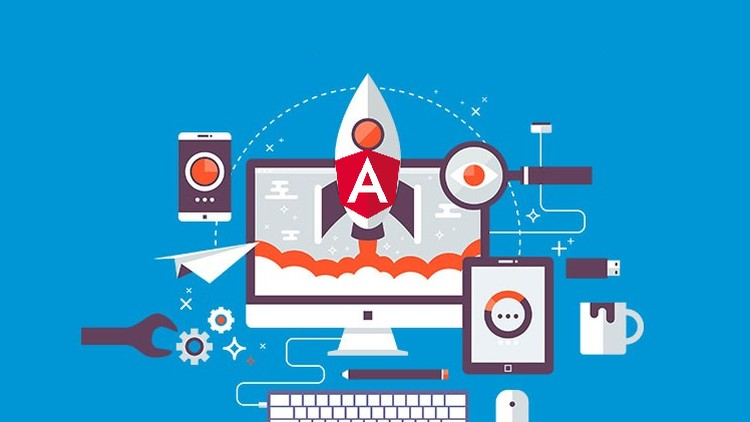
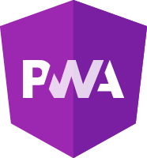
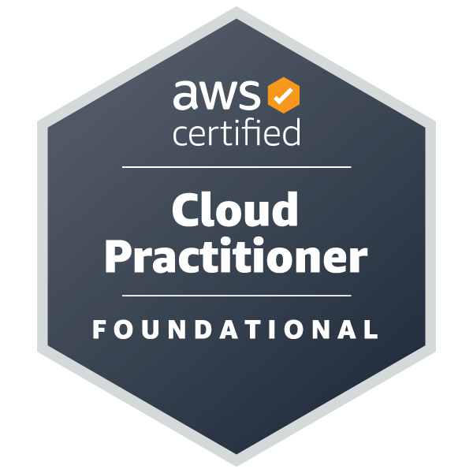

<h1 align="center">¡Hola! , soy Jaime Burgos</h1>
 
 
   

<h3 align="center">Soy un desarrollador de aplicaciones de APIs , Web, PWA  aplicando Unit Test y E2E Testing a las aplicaciones bajo metodologias ágiles</h3>

- 💬 Preguntame sobre ... **Desarrollo web y de APIS**
- 📫 Me puedes escribir : **jaimeburgostejada@gmail.com**

<h4>Lenguajes que manejo y herramientas</h4>

<!-- Iconos proporcionados por https://devicon.dev/ -->

<h4>Certificaciones</h4>

 
  

  

   

 
  

  

  

 
  

<h4>Estadísticas de GitHub</h4>

