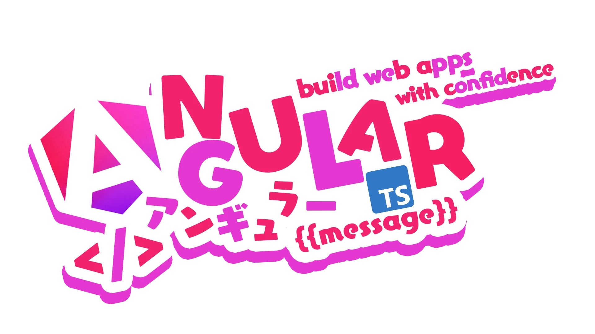

<h1 align="center">Hi there!  I'm Jaime Burgos</h1>

  

- 💬 Ask me about **Web Development, APIs, PWA , TWA , Angular, NestJS, and Cloud Architectures**  
- 🏗️ Experienced in building **scalable monorepo architectures with Angular & NestJS** and designing **scalable microservices-based systems with microfrontends**
- 🔍 Passionate about **performance optimization** and **best practices**  
- 🧪 Advocate of **Unit Testing & E2E Testing** (Jasmine, Karma, Cypress, Jest)  
- 📈 Skilled in **Agile methodologies**, CI/CD pipelines, and performance optimizations  
- 🌎 Cloud certified across **AWS, Azure, and Google Cloud**  
- 📫 Reach me at: **jaimeburgostejada@gmail.com**  

---

## 🛠️ Tech Stack & Tools  

<!-- Icons from https://devicon.dev/ and custom -->

  
**Frontend & UI**  
 
 
 
 
 
 
 
 

**Testing & Code Quality**  
 
 
 
 
 

**Backend & APIs**  
 
 
 
 

**Databases & Cloud**  
 
 
 
 
 
 
 
 

**DevOps & Monitoring**  
 
 
 
 
 
 

---

## 📜 Certifications  

**AWS**  

  

**Azure**  

  

**Google Cloud**  

  

---

## 📊 GitHub Stats  

  

---

✨ *Passionate about building robust architectures, contributing to open-source, and pushing boundaries in web development and cloud technologies.*  
